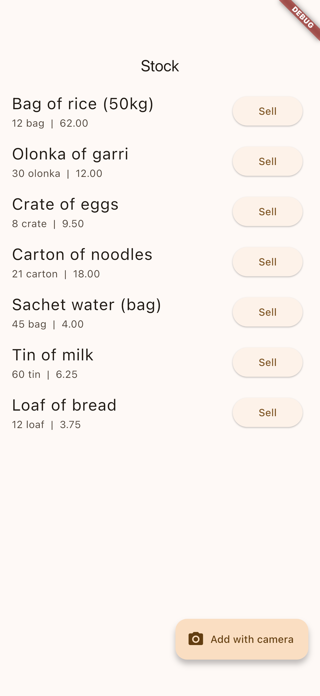
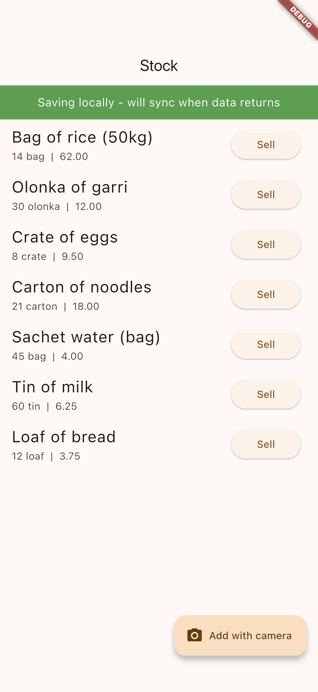
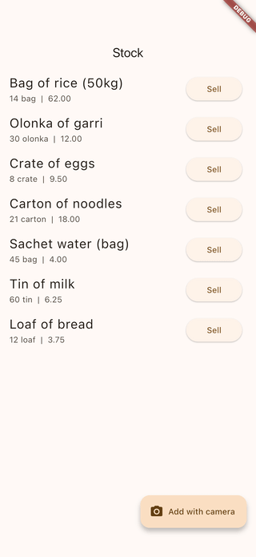

# Flutter Offline-First OCR + Firebase Sync POC

A Flutter + Riverpod proof-of-concept that demonstrates an offline-first vendor inventory app: SQLite as the source of truth, on-device ML Kit OCR for product capture, and a background sync engine that pushes changes to Firebase the moment connectivity returns. Built for low-literacy market vendors who need the app to work in airplane mode and survive blackouts.

## Demo

These are real captures from the running app on the iOS Simulator (no mockups). See [FLOW.md](FLOW.md) for how they are generated.

| Stock list (online) | After a sale | Offline sync banner |
| --- | --- | --- |
|  |  |  |



## What this POC demonstrates

- SQLite (sqflite) as the local source of truth - every read/write goes through local DB first
- A change-log table that records every mutation as a sync intent (insert/update/delete)
- A `SyncEngine` that drains the change log to Firestore in batches when connectivity is restored
- On-device Google ML Kit Text Recognition for "Add product with camera" and "Sell with camera"
- Connectivity-aware status banner ("Saving locally - will sync when data returns")
- Conflict resolution policy: last-write-wins keyed on `updated_at`
- Riverpod providers expose reactive state for inventory, sync queue, and connectivity
- Voice-first, big-button UI patterns suitable for low-literacy users

## Stack

- Flutter 3.x
- Riverpod 2.x for state management
- sqflite for the local SQLite database
- google_mlkit_text_recognition for on-device OCR
- cloud_firestore + firebase_core for sync target
- connectivity_plus for online/offline detection
- camera for capture

## Architecture

```
lib/
├── core/
│   ├── db/
│   │   ├── database.dart          # SQLite schema, migrations
│   │   ├── product_dao.dart       # CRUD that always writes change log entries
│   │   └── change_log.dart        # Pending sync intents
│   ├── sync/
│   │   ├── sync_engine.dart       # Drains change log to Firestore
│   │   └── connectivity_provider.dart
│   └── ocr/
│       └── text_recognizer.dart   # ML Kit wrapper
└── features/
    └── inventory/
        ├── inventory_controller.dart
        ├── camera_capture_screen.dart
        └── inventory_screen.dart
```

## How offline-first works in this POC

1. The user adds a product. `ProductDao.insert` writes to `products` AND appends a row to `change_log` in the same transaction.
2. The UI re-reads the local DB and updates immediately. The user sees their change with zero network dependency.
3. The `SyncEngine` listens for connectivity. When the device comes online it reads pending change-log rows in order, replays them against Firestore, and deletes the local entry on success.
4. If the app is killed mid-sync, the next launch picks up where it left off because the change log is durable.
5. Conflict resolution is last-write-wins keyed on `updated_at`. For a low-literacy single-user vendor app this is the right tradeoff.

## Why this matters for the job

The HAUS of SELMA Vendor App needs:
- 100 percent offline operation because power and network are unreliable
- SQLite + background Firebase sync
- On-device ML Kit OCR for camera capture
- Big-button UI for low-literacy users

This POC implements all four core requirements as a clean foundation that can be merged into the FlutterFlow project as a "Custom Code" widget set.

## Run

```bash
flutter pub get
flutter run
```
